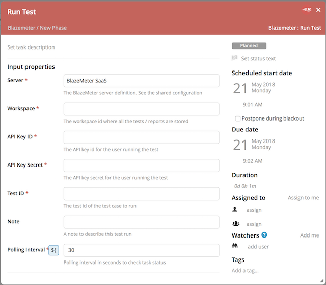

# xlr-Blazemeter-plugin

[![License: MIT][xlr-Blazemeter-plugin-license-image]][xlr-Blazemeter-plugin-license-url]
[![Github All Releases][xlr-Blazemeter-plugin-downloads-image]]()

[xlr-Blazemeter-plugin-license-image]: https://img.shields.io/badge/License-MIT-yellow.svg
[xlr-Blazemeter-plugin-license-url]: https://opensource.org/licenses/MIT
[xlr-Blazemeter-plugin-downloads-image]: https://img.shields.io/github/downloads/xebialabs-community/xlr-Blazemeter-plugin/total.svg

# XL Release Blazemeter Plugin

## Preface

This document describes the functionality provide by the `xlr-Blazemeter-plugin`

## Overview

This module offers a basic interface to Blazemeter functionality.

## XL Release Scenario

Blazemeter markets a commercial, self-service load testing platform as a service (PaaS), which is compatible with open-source Apache JMeter, the performance testing framework from the Apache Software Foundation. Blazemeter comes with a well documented API layer with integration into a number of testing frameworks, incl. JMeter, Gatling, Selenium and Taurus.

### Design decisions on plugin scope

The plugin now supports multiple-scenario / multiple location tests. It will monitor **all** sessions until completion. Finally, it will log the test report summary URL for more information.

## Installation

1. Copy the plugin JAR file into the `SERVER_HOME/plugins` directory of XL Release.
2. Configure your Blazemeter URL and API Key in Shared Configuration.

## Available Tasks

### Run Blazemeter Test

The **Blazemeter: Run Test** task type runs a preconfigured load test. It requires you to specify the following information:

* The Api Key which identifies the user 'id:secret' associated with the project / workspace.
* The Test ID to identify the test.
* The Workspace ID for the tests / reports
* The desired polling interval to check for updates

### Add Test Data

The **Blazemeter: Add Data** task type allows you to add data to a test. It requires you to specify the following information:

* The Api Key which identifies the user 'id:secret' associated with the project / workspace.
* The Test ID to identify the test.
* The Test Data property defined in XL Release of type "list_of_string".
* The Filename to use when uploading the Test Data.

Example: ["('Header 1', 'Header 2')", "('Row 1 Value 1', 'Row 1 Value 2')", "('Row 2 Value 1', 'Row 2 Value 2')"]

## References:
* [Blazemeter REST APIs](https://guide.Blazemeter.com/hc/en-us/articles/206732689-Blazemeter-REST-APIs)
